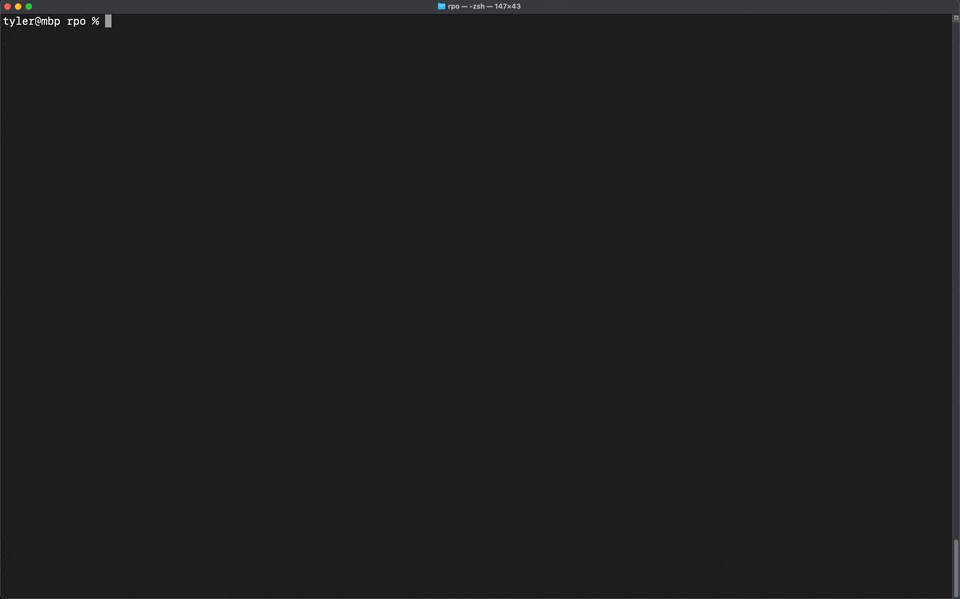
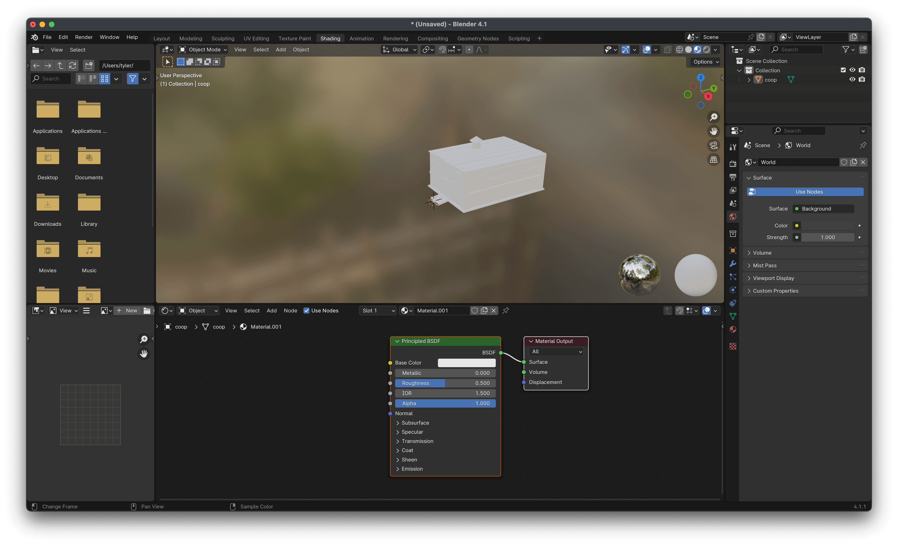
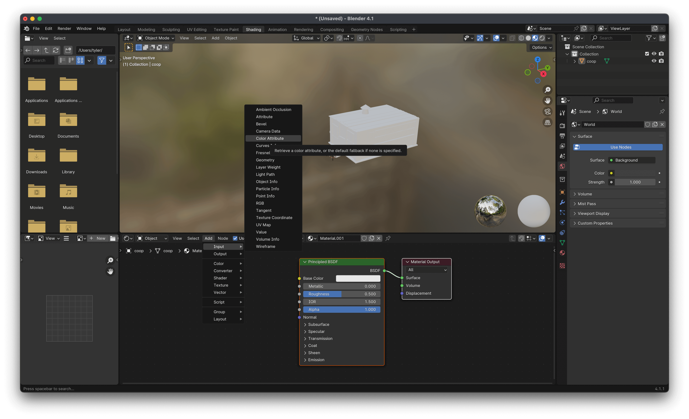
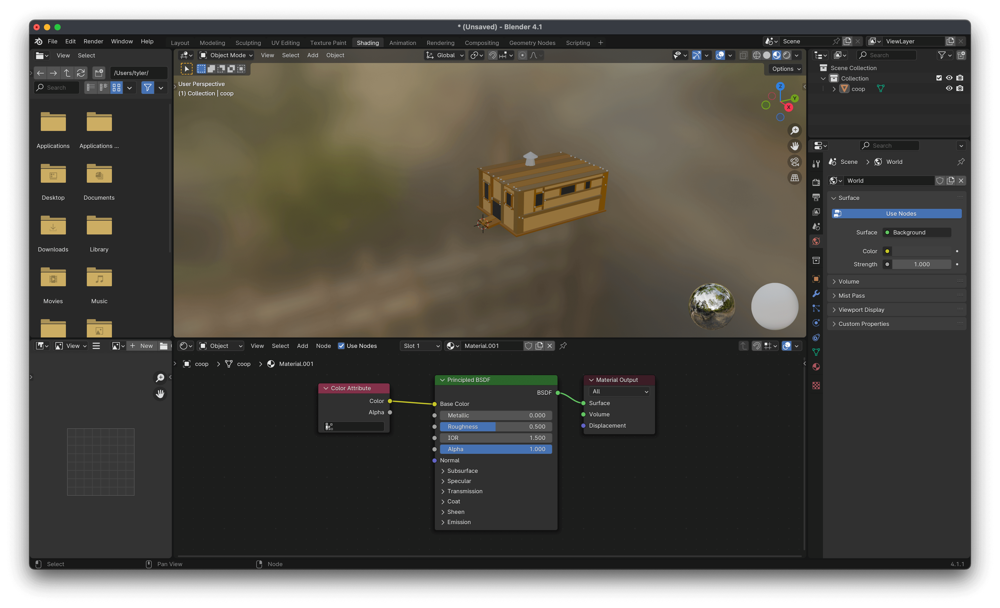

# rpotool

[](https://GitHub.com/tylertms/rpotool/releases/)
[](https://github.com/tylertms/rpotool/blob/main/LICENSE)

- [Installation](#installation)
- [Usage](#usage)
  - [Overview](#overview)
  - [Commands](#commands)
- [Compiling](#compiling)
- [Importing to Blender](#importing-to-blender)
- [Installing libcurl](#installing-libcurl)
- [License](#license)

## Installation

1. Download the latest version of `rpotool` for your system from [GitHub releases](https://github.com/tylertms/rpotool/releases).

2. Extract the `.zip` archive and `cd` into the folder.

3. On macOS/Linux:
```
chmod +x rpotool
```

4. If you are missing `libcurl` when using `rpotool fetch`, follow the instructions in [Installing libcurl](#installing-libcurl).
  

## Usage

### Overview
macOS/Linux:
```
./rpotool [command] [options]
```

Windows:
```
rpotool.exe [command] [options]
```

To obtain the default `.rpo` assets, unzip a `.apk` or `.ipa` game file and open the `/rpos` directory.

To obtain `.rpoz` shell assets, see the `fetch` command below.

### Commands
To convert an .rpo or .rpoz file, use the `convert` command.

```
Convert an Egg, Inc. .rpo(z) file to the .obj format.

Usage:
  ./rpotool convert <file.rpo(z)> [flags]

Flags:
  -o, --output    Specify the name of the output file
  -h, --help      Display this help message
```



To browse shell .rpoz files, use the `fetch` command.

```
Interactively browse and download available .rpoz shells as .obj files.

Usage:
  ./rpotool fetch [flags]

Flags:
  -h, --help      Display this help message
```


## Compiling

`libcurl` and `zlib` installed on your system.

A compiler, such as `gcc` or `clang`

```shell
$ git clone https://github.com/tylertms/rpotool.git
$ cd rpotool
$ gcc -o rpotool src/*.c -lz -lcurl
```

## Importing to Blender

By default, Blender does not recognize the vertex colors/textures in the converted .obj files.

After importing your .obj file into blender, complete the following:

1. Open the shading tab and select `+ New` to create a new material



2. Select `Add > Input > Color Attribute`



3. Connect the `Color` node of `Color Attribute` to the `Base Color` node of the material



## Installing libcurl

Most systems come preinstalled with libcurl dynamic libraries.

However, if you face errors related to missing libcurl, try installing the corresponding library for your system.

macOS:
```
brew install curl
```

Linux:
```
sudo apt-get install libcurl4-gnutls-dev
```

Windows:
```
The Windows release comes packaged with libcurl-x64.dll.
Either keep libcurl-x64.dll in the same directory as rpotool.exe, or move it to C:\Windows\System32.
```

## License

`rpotool` is released under the [MIT license](https://github.com/tylertms/rpotool/blob/main/LICENSE).
